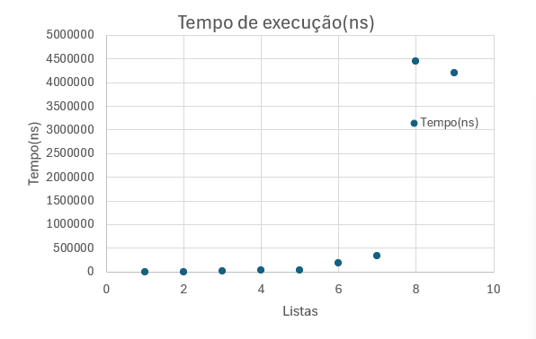
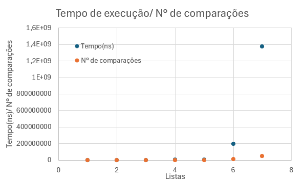

# Relátorio Aula_01(27/02/2005)
#### Felipe Fazio da Costa; RA: 23.00055-4

## Introdução:
Este relatório apresenta a resolução dos exercícios propostos na Aula 01 da disciplina. Os exercícios envolvem a implementação e análise de algoritmos em Java para manipulação de vetores e matrizes, avaliando o tempo de execução e o número de operações realizadas.

Os experimentos foram repetidos para diferentes tamanhos de entrada, com cálculos de médias e geração de gráficos para análise do desempenho. O objetivo é compreender o impacto do crescimento dos dados na eficiência dos algoritmos.

## Exercício 01
### Codigo utilizado:
```java
public class ex_1 {
    public static void main(String[] args) {
        int[] parametros = {10, 50, 100, 500, 1000, 5000, 10000, 100000, 500000};
        int repetitions = 5;

        for (int tamanho : parametros) {
            long[] times = new long[repetitions];
            long[] operationsArray = new long[repetitions];
            long[] comparisonsArray = new long[repetitions];

            for (int rep = 0; rep < repetitions; rep++) {
                long startTime = System.nanoTime(); // Captura o tempo inicial

                // Cria um array com o tamanho atual (tamanho)
                int[] array_test = new int[tamanho];

                // Contadores de operações aritméticas e comparações
                long operations = 0;
                long comparisons = 0;

                // Preenche o array com zeros
                for (int j = 0; j < array_test.length; j++) {
                    array_test[j] = 0;
                    operations++; // Operação de atribuição
                    comparisons++; // Comparação do loop
                }

                long endTime = System.nanoTime(); // Captura o tempo final
                long timeElapsed = endTime - startTime; // Calcula o tempo decorrido

                times[rep] = timeElapsed;
                operationsArray[rep] = operations;
                comparisonsArray[rep] = comparisons;
            }

            // Calcula as médias
            long totalTime = 0;
            long totalOperations = 0;
            long totalComparisons = 0;
            for (int i = 0; i < repetitions; i++) {
                totalTime += times[i];
                totalComparisons += comparisonsArray[i];
            }
            long averageTime = totalTime / repetitions;
            long averageComparisons = totalComparisons / repetitions;

            // Exibe os resultados
            System.out.println("Tamanho: " + tamanho);
            for (int i = 0; i < repetitions; i++) {
                System.out.println("Execução " + (i + 1) + ":");
                System.out.println("Tempo de execução em Nanosegundos: " + times[i]);
                System.out.println("Comparações: " + comparisonsArray[i]);
            }
            System.out.println("Média de tempo de execução em Nanosegundos: " + averageTime);
            System.out.println("Média de comparações: " + averageComparisons);
            System.out.println("--------------------------------");
        }
    }
}
```
### Medições:
```sh
Tamanho: 10
Execução 1:
Tempo de execução em Nanosegundos: 1900
Comparações: 10
Execução 2:
Tempo de execução em Nanosegundos: 600
Comparações: 10
Execução 3:
Tempo de execução em Nanosegundos: 500
Comparações: 10
Execução 4:
Tempo de execução em Nanosegundos: 400
Comparações: 10
Execução 5:
Tempo de execução em Nanosegundos: 500
Comparações: 10
Média de tempo de execução em Nanosegundos: 780
Média de comparações: 10
--------------------------------
Tamanho: 50
Execução 1:
Tempo de execução em Nanosegundos: 2200
Comparações: 50
Execução 2:
Tempo de execução em Nanosegundos: 1600
Comparações: 50
Execução 3:
Tempo de execução em Nanosegundos: 1800
Comparações: 50
Execução 4:
Tempo de execução em Nanosegundos: 1800
Comparações: 50
Execução 5:
Tempo de execução em Nanosegundos: 1700
Comparações: 50
Média de tempo de execução em Nanosegundos: 1820
Média de comparações: 50
--------------------------------
Tamanho: 100
Execução 1:
Tempo de execução em Nanosegundos: 3900
Comparações: 100
Execução 2:
Tempo de execução em Nanosegundos: 3300
Comparações: 100
Execução 3:
Tempo de execução em Nanosegundos: 3000
Comparações: 100
Execução 4:
Tempo de execução em Nanosegundos: 2800
Comparações: 100
Execução 5:
Tempo de execução em Nanosegundos: 2800
Comparações: 100
Média de tempo de execução em Nanosegundos: 3160
Média de comparações: 100
--------------------------------
Tamanho: 500
Execução 1:
Tempo de execução em Nanosegundos: 16600
Comparações: 500
Execução 2:
Tempo de execução em Nanosegundos: 34400
Comparações: 500
Execução 3:
Tempo de execução em Nanosegundos: 15300
Comparações: 500
Execução 4:
Tempo de execução em Nanosegundos: 14100
Comparações: 500
Execução 5:
Tempo de execução em Nanosegundos: 16000
Comparações: 500
Média de tempo de execução em Nanosegundos: 19280
Média de comparações: 500
--------------------------------
Tamanho: 1000
Execução 1:
Tempo de execução em Nanosegundos: 20400
Comparações: 1000
Execução 2:
Tempo de execução em Nanosegundos: 17800
Comparações: 1000
Execução 3:
Tempo de execução em Nanosegundos: 18100
Comparações: 1000
Execução 4:
Tempo de execução em Nanosegundos: 17400
Comparações: 1000
Execução 5:
Tempo de execução em Nanosegundos: 17800
Comparações: 1000
Média de tempo de execução em Nanosegundos: 18300
Média de comparações: 1000
--------------------------------
Tamanho: 5000
Execução 1:
Tempo de execução em Nanosegundos: 157500
Comparações: 5000
Execução 2:
Tempo de execução em Nanosegundos: 173200
Comparações: 5000
Execução 3:
Tempo de execução em Nanosegundos: 130400
Comparações: 5000
Execução 4:
Tempo de execução em Nanosegundos: 127100
Comparações: 5000
Execução 5:
Tempo de execução em Nanosegundos: 150900
Comparações: 5000
Média de tempo de execução em Nanosegundos: 147820
Média de comparações: 5000
--------------------------------
Tamanho: 10000
Execução 1:
Tempo de execução em Nanosegundos: 205200
Comparações: 10000
Execução 2:
Tempo de execução em Nanosegundos: 258800
Comparações: 10000
Execução 3:
Tempo de execução em Nanosegundos: 234100
Comparações: 10000
Execução 4:
Tempo de execução em Nanosegundos: 344400
Comparações: 10000
Execução 5:
Tempo de execução em Nanosegundos: 369400
Comparações: 10000
Média de tempo de execução em Nanosegundos: 282380
Média de comparações: 10000
--------------------------------
Tamanho: 100000
Execução 1:
Tempo de execução em Nanosegundos: 3687600
Comparações: 100000
Execução 2:
Tempo de execução em Nanosegundos: 791900
Comparações: 100000
Execução 3:
Tempo de execução em Nanosegundos: 625400
Comparações: 100000
Execução 4:
Tempo de execução em Nanosegundos: 534400
Comparações: 100000
Execução 5:
Tempo de execução em Nanosegundos: 630300
Comparações: 100000
Média de tempo de execução em Nanosegundos: 1253920
Média de comparações: 100000
--------------------------------
Tamanho: 500000
Execução 1:
Tempo de execução em Nanosegundos: 2187600
Comparações: 500000
Execução 2:
Tempo de execução em Nanosegundos: 2793500
Comparações: 500000
Execução 3:
Tempo de execução em Nanosegundos: 4565900
Comparações: 500000
Execução 4:
Tempo de execução em Nanosegundos: 1988900
Comparações: 500000
Execução 5:
Tempo de execução em Nanosegundos: 3612500
Comparações: 500000
Média de tempo de execução em Nanosegundos: 3029680
Média de comparações: 500000
```
* Após analisar os resultados apresentados, podemos afirmar que, devido à simplicidade e ao tamanho reduzido do programa, há uma alta variação nos resultados.

## Exercício 02:
### Código utilizado:
```java
public class ex_2 {
    public static void main(String[] args) {
        int[] parametros = {10, 50, 100, 500, 1000, 5000, 10000, 100000, 500000};
        int repetitions = 5;

        for (int tamanho : parametros) {
            long[] times = new long[repetitions];
            long[] operationsArray = new long[repetitions];
            long[] comparisonsArray = new long[repetitions];

            for (int rep = 0; rep < repetitions; rep++) {
                long startTime = System.nanoTime(); // Captura o tempo inicial

                int[] array_test = new int[tamanho];
                int[] array_copy = new int[tamanho];

                // Contadores de operações aritméticas e comparações
                long operations = 0;
                long comparisons = 0;

                for (int j = 0; j < array_test.length; j++) {
                    array_copy[j] = array_test[j];
                    operations++; // Operação de atribuição
                    comparisons++; // Comparação do loop
                }

                long endTime = System.nanoTime(); // Captura o tempo final
                long timeElapsed = endTime - startTime; // Calcula o tempo decorrido

                times[rep] = timeElapsed;
                operationsArray[rep] = operations;
                comparisonsArray[rep] = comparisons;
            }

            // Calcula as médias
            long totalTime = 0;
            long totalOperations = 0;
            long totalComparisons = 0;
            for (int i = 0; i < repetitions; i++) {
                totalTime += times[i];
                totalComparisons += comparisonsArray[i];
            }
            long averageTime = totalTime / repetitions;
            long averageComparisons = totalComparisons / repetitions;

            // Exibe os resultados
            System.out.println("Tamanho: " + tamanho);
            for (int i = 0; i < repetitions; i++) {
                System.out.println("Execução " + (i + 1) + ":");
                System.out.println("Tempo de execução em Nanosegundos: " + times[i]);
                System.out.println("Comparações: " + comparisonsArray[i]);
            }
            System.out.println("Média de tempo de execução em Nanosegundos: " + averageTime);
            System.out.println("Média de comparações: " + averageComparisons);
            System.out.println("--------------------------------");
        }
    }
}
```
### Medições:
```sh
Tamanho: 10
Execução 1:
Tempo de execução em Nanosegundos: 1300
Comparações: 10
Execução 2:
Tempo de execução em Nanosegundos: 500
Comparações: 10
Execução 3:
Tempo de execução em Nanosegundos: 400
Comparações: 10
Execução 4:
Tempo de execução em Nanosegundos: 400
Comparações: 10
Execução 5:
Tempo de execução em Nanosegundos: 400
Comparações: 10
Média de tempo de execução em Nanosegundos: 600
Média de comparações: 10
--------------------------------
Tamanho: 50
Execução 1:
Tempo de execução em Nanosegundos: 2300
Comparações: 50
Execução 2:
Tempo de execução em Nanosegundos: 1700
Comparações: 50
Execução 3:
Tempo de execução em Nanosegundos: 1800
Comparações: 50
Execução 4:
Tempo de execução em Nanosegundos: 2200
Comparações: 50
Execução 5:
Tempo de execução em Nanosegundos: 1900
Comparações: 50
Média de tempo de execução em Nanosegundos: 1980
Média de comparações: 50
--------------------------------
Tamanho: 100
Execução 1:
Tempo de execução em Nanosegundos: 2700
Comparações: 100
Execução 2:
Tempo de execução em Nanosegundos: 2500
Comparações: 100
Execução 3:
Tempo de execução em Nanosegundos: 2100
Comparações: 100
Execução 4:
Tempo de execução em Nanosegundos: 2200
Comparações: 100
Execução 5:
Tempo de execução em Nanosegundos: 2200
Comparações: 100
Média de tempo de execução em Nanosegundos: 2340
Média de comparações: 100
--------------------------------
Tamanho: 500
Execução 1:
Tempo de execução em Nanosegundos: 19800
Comparações: 500
Execução 2:
Tempo de execução em Nanosegundos: 49800
Comparações: 500
Execução 3:
Tempo de execução em Nanosegundos: 17600
Comparações: 500
Execução 4:
Tempo de execução em Nanosegundos: 35400
Comparações: 500
Execução 5:
Tempo de execução em Nanosegundos: 20600
Comparações: 500
Média de tempo de execução em Nanosegundos: 28640
Média de comparações: 500
--------------------------------
Tamanho: 1000
Execução 1:
Tempo de execução em Nanosegundos: 40200
Comparações: 1000
Execução 2:
Tempo de execução em Nanosegundos: 76900
Comparações: 1000
Execução 3:
Tempo de execução em Nanosegundos: 20700
Comparações: 1000
Execução 4:
Tempo de execução em Nanosegundos: 20500
Comparações: 1000
Execução 5:
Tempo de execução em Nanosegundos: 20800
Comparações: 1000
Média de tempo de execução em Nanosegundos: 35820
Média de comparações: 1000
--------------------------------
Tamanho: 5000
Execução 1:
Tempo de execução em Nanosegundos: 180900
Comparações: 5000
Execução 2:
Tempo de execução em Nanosegundos: 184300
Comparações: 5000
Execução 3:
Tempo de execução em Nanosegundos: 185600
Comparações: 5000
Execução 4:
Tempo de execução em Nanosegundos: 173500
Comparações: 5000
Execução 5:
Tempo de execução em Nanosegundos: 198600
Comparações: 5000
Média de tempo de execução em Nanosegundos: 184580
Média de comparações: 5000
--------------------------------
Tamanho: 10000
Execução 1:
Tempo de execução em Nanosegundos: 324200
Comparações: 10000
Execução 2:
Tempo de execução em Nanosegundos: 280200
Comparações: 10000
Execução 3:
Tempo de execução em Nanosegundos: 292400
Comparações: 10000
Execução 4:
Tempo de execução em Nanosegundos: 359300
Comparações: 10000
Execução 5:
Tempo de execução em Nanosegundos: 412500
Comparações: 10000
Média de tempo de execução em Nanosegundos: 333720
Média de comparações: 10000
--------------------------------
Tamanho: 100000
Execução 1:
Tempo de execução em Nanosegundos: 1741800
Comparações: 100000
Execução 2:
Tempo de execução em Nanosegundos: 678000
Comparações: 100000
Execução 3:
Tempo de execução em Nanosegundos: 12500100
Comparações: 100000
Execução 4:
Tempo de execução em Nanosegundos: 3660100
Comparações: 100000
Execução 5:
Tempo de execução em Nanosegundos: 3673500
Comparações: 100000
Média de tempo de execução em Nanosegundos: 4450700
Média de comparações: 100000
--------------------------------
Tamanho: 500000
Execução 1:
Tempo de execução em Nanosegundos: 5209900
Comparações: 500000
Execução 2:
Tempo de execução em Nanosegundos: 4346600
Comparações: 500000
Execução 3:
Tempo de execução em Nanosegundos: 3650500
Comparações: 500000
Execução 4:
Tempo de execução em Nanosegundos: 4816000
Comparações: 500000
Execução 5:
Tempo de execução em Nanosegundos: 2998800
Comparações: 500000
Média de tempo de execução em Nanosegundos: 4204360
Média de comparações: 500000
```
* Como já mencionado anteriormente, ainda é possível observar uma flutuação nos dados. Além disso, embora o segundo exercício seja mais "demorado", o tempo médio em alguns casos ficou abaixo do registrado no primeiro exercício.

## Exercício 03:
### Código utilizado:
```java
public class ex_3 {
    public static void main(String[] args) {
        int[] parametros = {10, 10, 50, 75, 100, 300, 500, 200, 1000, 1000, 5000, 7000, 10000, 1, 50000, 25000, 100000, 100000, 500000, 1000};
        int repetitions = 5;

        for (int tamanho = 0; tamanho < parametros.length; tamanho += 2) {
            long[] times = new long[repetitions];
            long[] operationsArray = new long[repetitions];
            long[] comparisonsArray = new long[repetitions];

            for (int rep = 0; rep < repetitions; rep++) {
                long startTime = System.nanoTime(); // Captura o tempo inicial

                // Criar uma matriz, baseado em valores dos parametros
                double matriz[][] = new double[parametros[tamanho]][parametros[tamanho + 1]];
                // Contadores de operações aritméticas e comparações
                long operations = 0;
                long comparisons = 0;

                // Limpar a matriz e colocar em todas as posições o valor -1
                for (int i = 0; i < matriz.length; i++) {
                    for (int j = 0; j < matriz[i].length; j++) {
                        matriz[i][j] = -1;
                        operations++; // Operação de atribuição
                        comparisons++; // Comparação do loop
                    }
                }

                long endTime = System.nanoTime(); // Captura o tempo final
                long timeElapsed = endTime - startTime; // Calcula o tempo decorrido

                times[rep] = timeElapsed;
                operationsArray[rep] = operations;
                comparisonsArray[rep] = comparisons;

                // Liberar memória
                matriz = null;
                System.gc();
            }

            // Calcula as médias
            long totalTime = 0;
            long totalOperations = 0;
            long totalComparisons = 0;
            for (int i = 0; i < repetitions; i++) {
                totalTime += times[i];
                totalComparisons += comparisonsArray[i];
            }
            long averageTime = totalTime / repetitions;
            long averageComparisons = totalComparisons / repetitions;

            // Exibe os resultados
            System.out.println("Tamanho: " + parametros[tamanho] + "x" + parametros[tamanho + 1]);
            for (int i = 0; i < repetitions; i++) {
                System.out.println("Execução " + (i + 1) + ":");
                System.out.println("Tempo de execução em Nanosegundos: " + times[i]);
                System.out.println("Comparações: " + comparisonsArray[i]);
            }
            System.out.println("Média de tempo de execução em Nanosegundos: " + averageTime);
            System.out.println("Média de comparações: " + averageComparisons);
            System.out.println("--------------------------------");
        }
    }
}
```
### Medições:
```sh
Tamanho: 10x10
Execução 1:
Tempo de execução em Nanosegundos: 16400
Comparações: 100
Execução 2:
Tempo de execução em Nanosegundos: 20600
Comparações: 100
Execução 3:
Tempo de execução em Nanosegundos: 12200
Comparações: 100
Execução 4:
Tempo de execução em Nanosegundos: 10200
Comparações: 100
Execução 5:
Tempo de execução em Nanosegundos: 13700
Comparações: 100
Média de tempo de execução em Nanosegundos: 14620
Média de comparações: 100
--------------------------------
Tamanho: 50x75
Execução 1:
Tempo de execução em Nanosegundos: 90800
Comparações: 3750
Execução 2:
Tempo de execução em Nanosegundos: 115900
Comparações: 3750
Execução 3:
Tempo de execução em Nanosegundos: 103100
Comparações: 3750
Execução 4:
Tempo de execução em Nanosegundos: 126700
Comparações: 3750
Execução 5:
Tempo de execução em Nanosegundos: 89900
Comparações: 3750
Média de tempo de execução em Nanosegundos: 105280
Média de comparações: 3750
--------------------------------
Tamanho: 100x300
Execução 1:
Tempo de execução em Nanosegundos: 648300
Comparações: 30000
Execução 2:
Tempo de execução em Nanosegundos: 677000
Comparações: 30000
Execução 3:
Tempo de execução em Nanosegundos: 582000
Comparações: 30000
Execução 4:
Tempo de execução em Nanosegundos: 1071000
Comparações: 30000
Execução 5:
Tempo de execução em Nanosegundos: 1517900
Comparações: 30000
Média de tempo de execução em Nanosegundos: 899240
Média de comparações: 30000
--------------------------------
Tamanho: 500x200
Execução 1:
Tempo de execução em Nanosegundos: 1083400
Comparações: 100000
Execução 2:
Tempo de execução em Nanosegundos: 356100
Comparações: 100000
Execução 3:
Tempo de execução em Nanosegundos: 346200
Comparações: 100000
Execução 4:
Tempo de execução em Nanosegundos: 418700
Comparações: 100000
Execução 5:
Tempo de execução em Nanosegundos: 928800
Comparações: 100000
Média de tempo de execução em Nanosegundos: 626640
Média de comparações: 100000
--------------------------------
Tamanho: 1000x1000
Execução 1:
Tempo de execução em Nanosegundos: 24459500
Comparações: 1000000
Execução 2:
Tempo de execução em Nanosegundos: 10724700
Comparações: 1000000
Execução 3:
Tempo de execução em Nanosegundos: 6347500
Comparações: 1000000
Execução 4:
Tempo de execução em Nanosegundos: 10028500
Comparações: 1000000
Execução 5:
Tempo de execução em Nanosegundos: 3646900
Comparações: 1000000
Média de tempo de execução em Nanosegundos: 11041420
Média de comparações: 1000000
--------------------------------
Tamanho: 5000x7000
Execução 1:
Tempo de execução em Nanosegundos: 164050600
Comparações: 35000000
Execução 2:
Tempo de execução em Nanosegundos: 139726000
Comparações: 35000000
Execução 3:
Tempo de execução em Nanosegundos: 137746200
Comparações: 35000000
Execução 4:
Tempo de execução em Nanosegundos: 127054700
Comparações: 35000000
Execução 5:
Tempo de execução em Nanosegundos: 120763600
Comparações: 35000000
Média de tempo de execução em Nanosegundos: 137868220
Média de comparações: 35000000
--------------------------------
Tamanho: 10000x1
Execução 1:
Tempo de execução em Nanosegundos: 214800
Comparações: 10000
Execução 2:
Tempo de execução em Nanosegundos: 211700
Comparações: 10000
Execução 3:
Tempo de execução em Nanosegundos: 215700
Comparações: 10000
Execução 4:
Tempo de execução em Nanosegundos: 312400
Comparações: 10000
Execução 5:
Tempo de execução em Nanosegundos: 220000
Comparações: 10000
Média de tempo de execução em Nanosegundos: 234920
Média de comparações: 10000
--------------------------------
Exception in thread "main" java.lang.OutOfMemoryError: Java heap space
        at ex_3.main(ex_3.java:15)
        at java.base/java.lang.invoke.LambdaForm$DMH/0x00000190cd024400.invokeStatic(LambdaForm$DMH)
        at java.base/java.lang.invoke.LambdaForm$MH/0x00000190cd144c00.invoke(LambdaForm$MH)
        at java.base/java.lang.invoke.Invokers$Holder.invokeExact_MT(Invokers$Holder)
        at java.base/jdk.internal.reflect.DirectMethodHandleAccessor.invokeImpl(DirectMethodHandleAccessor.java:154)
```

* Nesse exercício, a matriz de 50.000 x 25.000 foi limitada pela memória heap da máquina utilizada. Para obter mais resultados, seria necessário um hardware mais potente.

## Exercício 04:
```java
public class MatrixSymmetryChecker {

    public static void main(String[] args) {
        int[] parametros = {10, 50, 100, 500, 1000, 5000, 10000, 50000, 100000, 500000};
        int repetitions = 5;

        for (int n = 0; n < parametros.length; n++) {
            long[] times = new long[repetitions];
            long[] operationsArray = new long[repetitions];
            long[] comparisonsArray = new long[repetitions];

            for (int rep = 0; rep < repetitions; rep++) {
                long startTime = System.nanoTime(); // Captura o tempo inicial

                int[][] matrix = new int[parametros[n]][parametros[n]]; // Corrigido para usar 'n'

                // Contadores de operações aritméticas e comparações
                long operations = 0;
                long comparisons = 0;

                boolean isSymmetric = checkSymmetry(matrix, operations, comparisons);

                long endTime = System.nanoTime(); // Captura o tempo final
                long timeElapsed = endTime - startTime; // Calcula o tempo decorrido

                times[rep] = timeElapsed;
                operationsArray[rep] = operations;
                comparisonsArray[rep] = comparisons;
            }

            // Calcula as médias
            long totalTime = 0;
            long totalComparisons = 0;
            for (int i = 0; i < repetitions; i++) {
                totalTime += times[i];
                totalComparisons += comparisonsArray[i];
            }
            long averageTime = totalTime / repetitions;
            long averageComparisons = totalComparisons / repetitions;

            // Exibe os resultados
            System.out.println("Matrix size: " + parametros[n] + "x" + parametros[n]);
            for (int i = 0; i < repetitions; i++) {
                System.out.println("Execução " + (i + 1) + ":");
                System.out.println("Tempo de execução em Nanosegundos: " + times[i]);
                System.out.println("Comparações: " + comparisonsArray[i]);
            }
            System.out.println("Média de tempo de execução em Nanosegundos: " + averageTime);
            System.out.println("Média de comparações: " + averageComparisons);
            System.out.println("--------------------------------");
        }
    }

    private static boolean checkSymmetry(int[][] matrix, long operations, long comparisons) {
        int n = matrix.length;
        for (int i = 0; i < n; i++) {
            for (int j = i + 1; j < n; j++) { // Verifica apenas metade da matriz
                comparisons++;
                if (matrix[i][j] != matrix[j][i]) {
                    return false;
                }
                operations++;
            }
        }
        return true;
    }
}
```
### Medições:
```sh
Matrix size: 10x10
Execução 1:
Tempo de execução em Nanosegundos: 134000
Comparações: 45
Execução 2:
Tempo de execução em Nanosegundos: 2600
Comparações: 45
Execução 3:
Tempo de execução em Nanosegundos: 1900
Comparações: 45
Execução 4:
Tempo de execução em Nanosegundos: 1800
Comparações: 45
Execução 5:
Tempo de execução em Nanosegundos: 1700
Comparações: 45
Média de tempo de execução em Nanosegundos: 28400
Média de comparações: 45
--------------------------------
Matrix size: 50x50
Execução 1:
Tempo de execução em Nanosegundos: 34900
Comparações: 1225
Execução 2:
Tempo de execução em Nanosegundos: 40500
Comparações: 1225
Execução 3:
Tempo de execução em Nanosegundos: 41000
Comparações: 1225
Execução 4:
Tempo de execução em Nanosegundos: 32700
Comparações: 1225
Execução 5:
Tempo de execução em Nanosegundos: 32100
Comparações: 1225
Média de tempo de execução em Nanosegundos: 36240
Média de comparações: 1225
--------------------------------
Matrix size: 100x100
Execução 1:
Tempo de execução em Nanosegundos: 139200
Comparações: 4950
Execução 2:
Tempo de execução em Nanosegundos: 126100
Comparações: 4950
Execução 3:
Tempo de execução em Nanosegundos: 130000
Comparações: 4950
Execução 4:
Tempo de execução em Nanosegundos: 138000
Comparações: 4950
Execução 5:
Tempo de execução em Nanosegundos: 146700
Comparações: 4950
Média de tempo de execução em Nanosegundos: 136000
Média de comparações: 4950
--------------------------------
Matrix size: 500x500
Execução 1:
Tempo de execução em Nanosegundos: 2810700
Comparações: 124750
Execução 2:
Tempo de execução em Nanosegundos: 1148200
Comparações: 124750
Execução 3:
Tempo de execução em Nanosegundos: 7693200
Comparações: 124750
Execução 4:
Tempo de execução em Nanosegundos: 851300
Comparações: 124750
Execução 5:
Tempo de execução em Nanosegundos: 1819500
Comparações: 124750
Média de tempo de execução em Nanosegundos: 2864580
Média de comparações: 124750
--------------------------------
Matrix size: 1000x1000
Execução 1:
Tempo de execução em Nanosegundos: 3459600
Comparações: 499500
Execução 2:
Tempo de execução em Nanosegundos: 5637300
Comparações: 499500
Execução 3:
Tempo de execução em Nanosegundos: 4198100
Comparações: 499500
Execução 4:
Tempo de execução em Nanosegundos: 2853700
Comparações: 499500
Execução 5:
Tempo de execução em Nanosegundos: 1855100
Comparações: 499500
Média de tempo de execução em Nanosegundos: 3600760
Média de comparações: 499500
--------------------------------
Matrix size: 5000x5000
Execução 1:
Tempo de execução em Nanosegundos: 188949700
Comparações: 12497500
Execução 2:
Tempo de execução em Nanosegundos: 193643100
Comparações: 12497500
Execução 3:
Tempo de execução em Nanosegundos: 193807900
Comparações: 12497500
Execução 4:
Tempo de execução em Nanosegundos: 198274200
Comparações: 12497500
Execução 5:
Tempo de execução em Nanosegundos: 194079600
Comparações: 12497500
Média de tempo de execução em Nanosegundos: 193750900
Média de comparações: 12497500
--------------------------------
Matrix size: 10000x10000
Execução 1:
Tempo de execução em Nanosegundos: 2096538300
Comparações: 49995000
Execução 2:
Tempo de execução em Nanosegundos: 1409266800
Comparações: 49995000
Execução 3:
Tempo de execução em Nanosegundos: 1120604500
Comparações: 49995000
Execução 4:
Tempo de execução em Nanosegundos: 1205772700
Comparações: 49995000
Execução 5:
Tempo de execução em Nanosegundos: 1032651700
Comparações: 49995000
Média de tempo de execução em Nanosegundos: 1372966800
Média de comparações: 49995000
--------------------------------
Exception in thread "main" java.lang.OutOfMemoryError: Java heap space
        at MatrixSymmetryChecker.main(ex_4.java:14)
        at java.base/java.lang.invoke.LambdaForm$DMH/0x0000025c91024400.invokeStatic(LambdaForm$DMH)
        at java.base/java.lang.invoke.LambdaForm$MH/0x0000025c91149400.invoke(LambdaForm$MH)
        at java.base/java.lang.invoke.Invokers$Holder.invokeExact_MT(Invokers$Holder)
        at java.base/jdk.internal.reflect.DirectMethodHandleAccessor.invokeImpl(DirectMethodHandleAccessor.java:154)
```
*  Nesse último exercício, foi possível observar o mesmo erro ocorrido no terceiro. Na matriz 10.000 x 10.000, a memória heap disponível na máquina não foi suficiente.

## Análise dos resultados:


      Figura 01 - Tabela de resultados exercício 01.

Como apresentado na tabela, conforme o aumento da lista há um aumento do tempo e do número de comparações.


      Figura 02 - Gráfico do tempo de execução exercício 01.

No gráfico é possivel ver que conforme o aumento da lista o tempo de execução aumenta de forma exponencial.


      Figura 03 - Tabela de resultados exercício 02.

Como mostrado na tabela, à medida que o tamanho da lista aumenta, observamos um aumento no tempo de execução e no número de comparações. No entanto, houve um desvio no padrão observado com o valor 100.000, que apresentou um tempo de execução maior do que o último valor. Uma possível explicação para esse comportamento é que o Sistema Operacional estava executando alguma tarefa em segundo plano, o que pode ter interferido na execução do código.



      Figura 04 - Gráfico do tempo de execução exercício 02.

No gráfico é possivel ver que conforme o aumento da lista o tempo de execução aumenta de forma exponencial.


      Figura 05 - Tabela de resultados exercício 03.

Como apresentado na tabela, à medida que o tamanho da matriz aumenta, observamos um aumento no tempo de execução das comparações para substituição dos valores. A matriz de maior dimensão (5000x7000) contém 35.000.000 de itens, enquanto a matriz de tamanho 10.000x1 possui apenas 10.000 itens, explicando assim as diferenças no tempo e no número de comparações.


      Figura 06 - Gráfico do tempo de execução exercício 03.


      Figura 05 - Tabela de resultados exercício 04.



      Figura 06 - Gráfico do tempo de execução exercício 04.

## Conclusão:

O relatório apresentou a resolução de quatro exercícios envolvendo a implementação e análise de algoritmos em Java, com foco na manipulação de vetores e matrizes. Os experimentos foram realizados com diferentes tamanhos de entrada, e os resultados foram analisados em termos de tempo de execução e número de operações realizadas.

Em todos os exercícios, foi possível observar que o tempo de execução e o número de operações aumentaram conforme o tamanho dos dados de entrada cresceu. Isso é consistente com a complexidade dos algoritmos implementados, que eram predominantemente lineares ou quadráticos em relação ao tamanho da entrada. Além disso, os erros de memória observados nos exercícios 3 e 4 destacam a importância de considerar as limitações de hardware ao trabalhar com grandes volumes de dados.

Os resultados obtidos reforçam a importância de se compreender a complexidade dos algoritmos e o impacto do crescimento dos dados no desempenho computacional. Para trabalhar com matrizes e vetores de grandes dimensões, é necessário **otimizar** o uso de memória e, em alguns casos, considerar o uso de **hardware mais potente** ou técnicas de processamento paralelo. Além disso, a flutuação nos tempos de execução observada em alguns casos sugere que fatores externos, como o sistema operacional e outras tarefas em execução, podem influenciar significativamente os resultados, especialmente em ambientes não controlados.