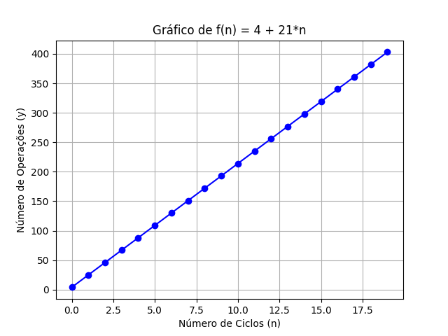

# Exercícios Propostos - Aula 04

## Felipe Fazio da Costa
**RA:** 23.00055-4  
**Disciplina:** ECM306 - Tópicos Avançados em Estrutura de Dados

---

## Exercício 1

### **Código Java:**

```java
package br.maua;

public class Tarefa_01A {

    public static int Func(int n) {
        int x = 30; //1
        for (int i = 0; i < n; ++i) { //2
            x = x + 2 - i; //3
        }
        return x;
    }

    public static void main(String[] args) {
        int resposta = Func(10);
        System.out.println("resposta = " + resposta);
    }
}
```

### **Análise de Complexidade:**
Esse algoritmo tem o seguinte número de operações:

* Linha 1: `int x = 30;`
    * 2 operações
* Linha 2: `for (int i = 0; i < n;i++) {`
    * 2 + 3*(n + 1) + 4n operações
    * 5 + 7*n operações
* Linha 3: `x = x + 2 - i;`
    * 6*n operações

**Equação final:** 
\[ T(n) = 7 + 13*n \]


---

## Exercício 2

### **Código Java:**
```java
package br.maua;

public class Tarefa_01B {
    public static int T(int n) {
        int abc = 30; //1
        for (int i = 1; i < n - 1; ++i) { //2
            abc *= 2; //3
            abc++; //4
        }
        return abc;
    }

    public static void main(String[] args) {
        int resposta = T(5);
        System.out.println("resposta = " + resposta);
    }
}
```
### **Análise de Complexidade:**
Esse algoritmo tem o seguinte número de operações:

* Linha 1: `int abc = 30;`
    * 2 operações
* Linha 2: `for (int i = 1; i < n - 1; ++i) {`
    * 2 + 4*(n + 1) + 4n operações
    * 6 + 8*n operações
* Linha 3: `abc *= 2;`
    * 4*n operações
* Linha 4: `abc++;`
    * 4*n operações

**Equação final:** 
\[ T(n) = 8 + 16*n \]


---

## Exercício 3

### **Código Java:**
```java
package br.maua;

public class Tarefa_01C {
    public static int Func(int n) {
        int x = 30; //1
        int i = 0; //2
        while (i < n) { //3
            x = x + 2 - i; //4
            i = i + 1; //5
        }
        return x;
    }

    public static void main(String[] args) {
        int resposta = Func(10);
        System.out.println("resposta = " + resposta);
    }
}
```
### **Análise de Complexidade:**
Esse algoritmo tem o seguinte número de operações:

* Linha 1: `int x = 30;`
    * 2 operações
* Linha 2: `int i = 0;`
    * 2 operações
* Linha 3: `while (i < n) {`
    * 3*(n+1) operações
* Linha 4: `x = x + 2 - i;`
    * 6*n operações
* Linha 5: `i = i + 1;`
    * 4*n operações

**Equação final:** 
\[ T(n) = 7 + 13*n \]


---

## Exercício 4

### **Código Java:**
```java
package br.maua;

public class Tarefa_01D {
    public static int T(int n) {
        int abc = 30; //1
        int i = 1; //2
        do {
            abc *= 2; //3
            abc++; //4
            i = i + 1; //5
        } while (i < n - 1); //6

        return abc;
    }

    public static void main(String[] args) {
        int resposta = T(5);
        System.out.println("resposta = " + resposta);
    }
}
```
### **Análise de Complexidade:**
Esse algoritmo tem o seguinte número de operações:

* Linha 1: `int abc = 30;`
    * 2 operações
* Linha 2: `int i = 1;`
    * 2 operações
* Linha 3: `do { abc *= 2;`
    * 4*n operações
* Linha 4: `abc++;`
    * 4*n operações
* Linha 5: `i = i + 1;`
    * 4*n operaçõesv
* Linha 6: `} while (i < n - 1);`
    * 5*n operações

**Equação final:** 
\[ T(n) = 4 + 21*n \]



---

## Exercício 5

### **Código Java:**
```java
package br.maua;

public class Tarefa_01E {
    public static final int Lista[] = {2, 6, 5, 1, 4};

    public static void main(String[] args) {
        int n = Lista.length;

        int x = 2;

        int Resposta = Func(Lista, x, n);

        System.out.println("Resultado = " + Resposta);
    }

    public static int Func(int[] a, int x, int n) {
        int resultado = a[n - 1]; //1

        for (int i = 0; i < a.length; i++) //2
            resultado = resultado * x + a[i]; //3

        return resultado;
    }
}
```
### **Análise de Complexidade:**
Esse algoritmo tem o seguinte número de operações:

* Linha 1: `int resultado = a[n - 1];`
    * 7 operações''
* Linha 2: `for (int i = 0; i < a.length; i++)`
    * : 2 + 3*(n + 1) + 4n operações
* Linha 3: `resultado = resultado * x + a[i];`
    * 8*n operações

**Equação final:** 
\[ T(n) = 12 + 15*n \]


---

## Conclusão

Neste conjunto de exercícios, analisamos a complexidade computacional de diferentes implementações em Java, explorando a forma como a quantidade de operações cresce em função da entrada \( n \). Os principais pontos observados foram:

1. **Crescimento Linear**: A maioria dos algoritmos apresentaram complexidade linear \( O(n) \), indicando que o tempo de execução cresce proporcionalmente ao tamanho da entrada.
2. **Estruturas de Repetição**: Tanto os loops `for`, `while` e `do-while` tiveram impacto direto na complexidade, sendo essencial entender a quantidade de iterações para determinar o número total de operações.
3. **Multiplicação e Aditivos Constantes**: Pequenas variações, como a adição de constantes ou multiplicação dentro dos loops, influenciaram os coeficientes das funções de complexidade, mas não alteraram suas ordens de crescimento.
4. **Gráficos Comparativos**: A visualização gráfica das funções de complexidade permitiu entender melhor a diferença entre os algoritmos, facilitando a análise de desempenho.

Através desta análise, foi possível reforçar a importância da avaliação de eficiência dos algoritmos, fundamental para aplicações práticas em sistemas que demandam alto desempenho.