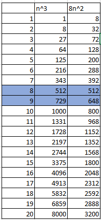
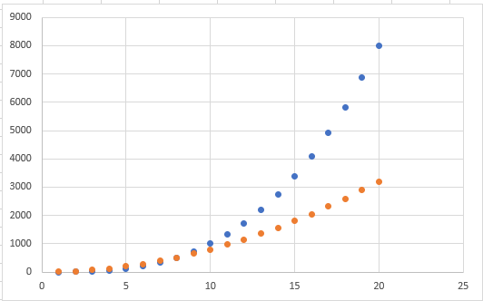
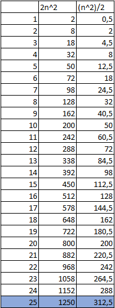
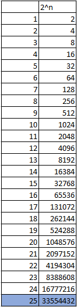

# Exercícios de aula de estrutura de dados
### Felipe Fazio da Costa; RA: 23.00055-4

## Exercício 01:
Considere dois algoritmos, A e B, com complexidades 8n2 e n3, respectivamente. Qual o maior valor de n, para o qual o algoritmo B é mais eficiente que o algoritmo A ?

Após colocar as funções no excel é possível analisar pelo gráfico e pela tabela os resultados e assim onde as funções se cruzam, dessa forma podemos afirmar que em n = 8 é o momento em que A e B se igualam, nos tempos posteriores o crescimento de B irá se afastando de A.

        Figura 1 - Tabela de valores.

        Figura 2 - Gráfico de valores.

## Exercício 02:
Um algoritmo tem complexidade 2n^2. Num certo computador, num tempo t, o algoritmo resolve um problema de tamanho 25. Imagine agora que se tenha disponível um computador 100 vezes mais rápido. Qual o tamanho máximo de problema que o mesmo algoritmo resolve no mesmo tempo t no computador mais rápido?

• Considere o mesmo problema para um algoritmo de complexidade 2^n.

Para análise fiz as tabelas de tempo para a primeira máquina na qual é a função normal e para a segunda máquina como é 100x mais rápida.

        Figura 3 - Tabela de valores.

Como o computador é 100x mais rápido temos, o mesmo tempo faz o que vazia antes 1250 * 100 = 125.000 operações
f(n) = 2n^2 = 125.000
n = 250.

        Figura 4 - Tabela de valores.
Como o computador é 100x mais rápido temos, o mesmo tempo faz o que vazia antes 1250 * 100 = x operações
f(n) = 2^n = x
n = 31.

## Exercício 03:
Suponha que uma empresa utiliza um algoritmo decomplexidade n2 que, em um tempo t, na máquina disponível, resolve um problema de tamanho x. Suponha que o tamanho do problema a ser resolvido aumentou em 20%, mas o tempo de resposta deve ser mantido. Para isso, a empresa pretende trocar a máquina por uma mais rápida. Qual percentual de melhoria no tempo de execução das operações básicas é necessário para atingir sua meta, considerando-se a execução do mesmo algoritmo?

• Suponha que no problema anterior, mantendo-se o mesmo algoritmo, ainda se queira reduzir em 50% o tempo de resposta. Qual a melhoria esperada para a nova máquina?

n^2 resolve um problema em certo tempo t: n^2 = x
precisa manter o tempo e aumentar o x em 20%
f1(n) = (1.2 * x)^2
f(n) = x^2

Igualando as duas temos:
tempo_velha = tempo_nova + 44% * tempo_nova

agora, precisamos de 50% menos tempo, dessa forma:
f1(n) = 0,5 * f(n)