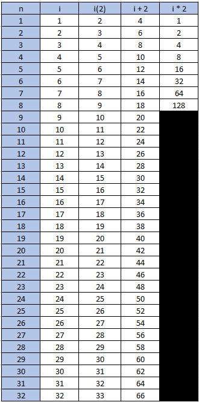
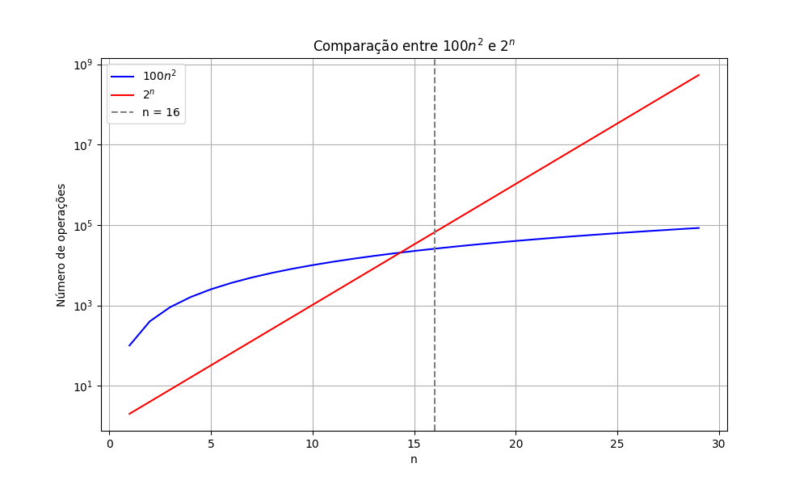
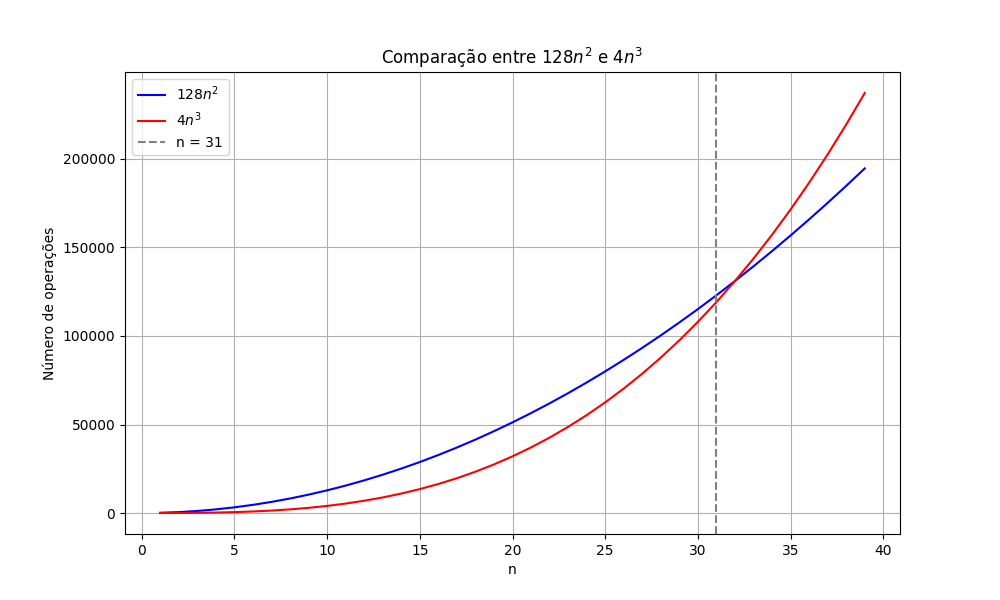

# Exercícios Propostos - Aula 05

## Felipe Fazio da Costa
**RA:** 23.00055-4  
**Disciplina:** ECM306 - Tópicos Avançados em Estrutura de Dados

---

## Exercício 1

```java
public class InsertionSort {

    public static void insertionSort(int[] array) {
        for (int i = 1; i < array.length; i++) {
            //2 + 3*(n + 1) + 4n operações
            int key = array[i];
            // 5n operações
            int j = i - 1;
            // 4n operações
            while (j >= 0 && array[j] > key) {
                // 4*(n+1)^2 + 5*(n+1)^2 operações

                array[j + 1] = array[j];
                // 5n^2 + 4n^2 operações
                j = j - 1;
                // 4n^2 operações
            }
            array[j + 1] = key;
            // 6n operações
        }
    }

    public static void main(String[] args) {
        int[] array = {12, 11, 13, 5, 6};

        System.out.println("Array antes da ordenacao:");
        for (int num : array) {
            System.out.print(num + " ");
        }

        insertionSort(array);

        System.out.println("\n\nArray depois a ordenacao:");
        for (int num : array) {
            System.out.print(num + " ");
        }
    }
}
```

---

## Exercício 2

### **Análise de Complexidade:**
Esse algoritmo tem o seguinte número de operações:

* Linha 1: `for (int i = 1; i < array.length; i++)`
    * 2 + 3*(n + 1) + 4n operações

* Linha 2: `int key = array[i];`
    * 4n operações

* Linha 3: `int j = i - 1;`
    * 4n operações

* Linha 4: `while (j >= 0 && array[j] > key) {`
    * 4*(n+1)^2 + 5*(n+1)^2 operações

* Linha 5: `array[j + 1] = array[j];`
    * 5n^2 + 4n^2 operações

* Linha 6: `j = j - 1;`
    * 4n^2 operações

* Linha 7: `array[j + 1] = key;`
    * 6n operações

**Equação final:** 
\[ T(n) = 14 + 40*n + 22*n^2 => O(n^2)\]

---

## Exercício 3

### **Código Java:**
```java
import java.util.Scanner;

public class TarefaT3_01 {
    public static void main(String[] args) {
        Scanner in = new Scanner(System.in);
        int n = in.nextInt();
        System.out.println(Func(n));
        in.close();
    }

    public static int Func(int n) {
        int m = 0;
        for (int i = 1; i <= n; i++) {
            for (int j = 1; j <= n; j++) {
                m = m + 1; // Linha 1
            }
        }
        return m;
    }
}
```

### **Análise de Complexidade:**
Esse algoritmo tem o seguinte número de operações:

* Linha 1: ` m = m + 1;`
    * 4*n^2

**Equação final:** 
\[ T(n) = 4*n^2 => O(n^2)\]

---

## Exercício 4

### **Código Java:**
```java
import java.util.Scanner;

public class TarefaT3_02 {
    public static void main(String[] args) {
        Scanner in = new Scanner(System.in);
        int n = in.nextInt();
        System.out.println(Func(n));
        in.close();
    }

    public static int Func(int n) {
        int m = 0;
        for (int i = 2; i <= n; i++) {
            for (int j = 2; j <= n; j++) {
                m = m + 1; // Linha 1
            }
        }
        return m;
    }
}
```

### **Análise de Complexidade:**
Esse algoritmo tem o seguinte número de operações:

* Linha 1: ` m = m + 1;`
    * 4*n^2 - 1

**Equação final:** 
\[ T(n) = 4*n^2 - 1 => O(n^2)\]

---

## Exercício 5

### **Código Java:**
```java
import java.util.Scanner;

public class TarefaT3_03 {
    public static void main(String[] args) {
        Scanner in = new Scanner(System.in);
        int n = in.nextInt();
        System.out.println(Func(n));
        in.close();
    }

    public static int Func(int n) {
        int i = 4;
        int m = 0;
        while (i <= n) {
            m = m + 1; // Linha 1
            i = i + 2;
        }
        return m;
    }
}

```

### **Análise de Complexidade:**
Esse algoritmo tem o seguinte número de operações:

* Linha 1: ` m = m + 1;`
    * (4*n)/2 + 1

**Equação final:** 
\[ T(n) = 2*n + 1 => O(n)\]

---

## Exercício 6

### **Código Java:**
```java
import java.util.Scanner;

public class TarefaT3_04 {
    public static void main(String[] args) {
        Scanner in = new Scanner(System.in);
        int n = in.nextInt();
        System.out.println(Func(n));
        in.close();
    }

    public static int Func(int n) {
        int i = 4;
        int m = 0;
        while (i <= n) {
            m = m + 1; // Linha 1
            i = i * 2;
        }
        return m;
    }
}

```

### **Análise de Complexidade:**
Esse algoritmo tem o seguinte número de operações:

* Linha 1: ` m = m + 1;`
    * 4 * log(n)

**Equação final:** 
\[ T(n) = 4 * log(n) => O(log(n))\]

---

## Exercício 7

### **Código Java:**
```java
import java.util.Scanner;

public class TarefaT3_05 {
    public static void main(String[] args) {
        Scanner in = new Scanner(System.in);
        int n = in.nextInt();
        System.out.println(Func(n));
        in.close();
    }

    public static int Func(int n) {
        int m = 0;
        for (int i = 1; i <= n; i++) {
            for (int j = i; j <= n; j++) {
                m = m + 1; // Linha 1
            }
        }
        return m;
    }
}
```

### **Análise de Complexidade:**
Esse algoritmo tem o seguinte número de operações:

* Linha 1: ` m = m + 1;`
    * 4 * n * (n+1)/2

**Equação final:** 
\[ T(n) = 4 * n * (n+1)/2 => O(n^2)\]

---

### Tabela analisada:

Para chegar nas conclusões, foi feita a análise conforme o tempo




## Exercício 8

Supondo-se que se está comparando implementações de ordenação por inserção e ordenação por intercalação na mesma máquina. Para entradas de tamanho n, a ordenação por inserção é executada 8n2 etapas, enquanto a ordenação por intercalação é executada em 64n ln n etapas. Para que valores de n a ordenação por inserção supera a ordenação por intercalação?

|  n  | Insertion Sort Steps(8n^2) | Merge Sort Steps(64n*ln(n)) | Insertion < Merge |
|----:|----------------------:|-----------------:|------------------:|
|   1 |                    8 |           0.0000 |            False |
|  11 |                  968 |        1688.1183 |             False |
|  21 |                 3528 |        4091.8382 |             False |
|  27 |                 5832 |        5695.2061 |             True |
|  31 |                 7688 |        6813.0306 |            True |
|  41 |                13448 |        9744.4131 |            True |
|  51 |                20808 |       12833.4789 |            True |
|  61 |                29768 |       16048.8516 |            True |
|  71 |                40328 |       19369.6174 |            True |
|  81 |                52488 |       22780.8244 |            True |


Pela tabela podemos ver que o código de inserção supera com n = 27 ordenação por intercalação.

.png)

## Exercício 9

Qual é o menor valor de n tal que um algoritmo cujo tempo de execução é 100n2 funciona mais rápido que um algoritmo cujo tempo de execução é 2n na mesma máquina?

|  n  | 100n²  | 2ⁿ  | 100n² < 2ⁿ |
|----:|--------:|------:|------------:|
|   1 |    100 |     2 |      False  |
|   2 |    400 |     4 |      False  |
|   3 |    900 |     8 |      False  |
|   4 |   1600 |    16 |      False  |
|   5 |   2500 |    32 |      False  |
|   6 |   3600 |    64 |      False  |
|   7 |   4900 |   128 |      False  |
|   8 |   6400 |   256 |      False  |
|   9 |   8100 |   512 |      False  |
|  10 |  10000 |  1024 |      False  |
|  11 |  12100 |  2048 |      False  |
|  12 |  14400 |  4096 |      False  |
|  13 |  16900 |  8192 |      False  |
|  14 |  19600 | 16384 |      False  |
|  15 |  22500 | 32768 |      False  |
|  16 |  25600 | 65536 |      True   |




        Gráfico com plot com log para melhor visualização

Pela tabela podemos ver que é no valor 16 o código de 2^n supera o 100n^2.

## Exercício 10

Considere dois algoritmos A e B com complexidades respectivamente iguais a 128n2 e 4n3. Qual o maior valor de n, para o qual o algoritmo B é mais eficiente que o algoritmo A?

|  n  | 128n²  | 4n³  | 4n³ < 128n² |
|----:|--------:|------:|------------:|
|   1 |    128 |     4 |      True   |
|   2 |    512 |    32 |      True   |
|   3 |   1152 |   108 |      True   |
|   4 |   2048 |   256 |      True   |
|   5 |   3200 |   500 |      True   |
|   6 |   4608 |   864 |      True   |
|   7 |   6272 |  1372 |      True   |
|   8 |   8192 |  2048 |      True   |
|   9 |  10368 |  2916 |      True   |
|  10 |  12800 |  4000 |      True   |
|  15 |  28800 | 13500 |      True   |
|  20 |  51200 | 32000 |      True   |
|  25 |  80000 | 62500 |      True   |
|  30 | 115200 | 108000 |      True   |
|  31 | 123904 | 119791 |      True   |
|  32 | 131072 | 131072 |      False  |
|  33 | 139392 | 143253 |      False  |




Pela tabela podemos ver que o código B é melhor até n igual a 31.

## Exercício 11

Considere dois computadores C1 e C2 que executam 108 e 1010 operações por segundo e dois algoritmos de ordenação A e B que necessitam 5n2 e 40n log10 n operações com entrada de tamanho n, respectivamente. Qual o tempo de execução de cada algoritmo em cada um dos computadores C1 e C2 para ordenar 108 elementos?

### Passo 1: Definição dos Dados  

- **Computadores:**  
  - \( C_1 \) executa \( 10^8 \) operações por segundo  
  - \( C_2 \) executa \( 10^10 \) operações por segundo  

- **Algoritmos:**  
  - Algoritmo \( A \) precisa de \( 5n^2 \) operações  
  - Algoritmo \( B \) precisa de \( 40n log_10 n \) operações  

- **Entrada:** \( n = 10^8 \) elementos  

## Algoritmo A

\[
\text{Operações}_A = 5n^2 = 5 (10^8)^2 = 5 \times 10^{16}
\]

## Algoritmo B

\[
\text{Operações}_B = 40n \log_{10} n = 40 \times 10^8 \times \log_{10} (10^8)
\]

\[
= 40 \times 10^8 \times 8 = 3.2 \times 10^{10}
\]

## Passo 3: Cálculo do Tempo de Execução

O tempo de execução é dado por:

\[
\text{Tempo} = \frac{\text{Número de operações}}{\text{Operações por segundo}}
\]

### Computador C1

\[
T_A (C_1) = \frac{5 \times 10^{16}}{10^8} = 5 \times 10^8 \text{ segundos} \approx 15.8 \text{ anos}
\]

\[
T_B (C_1) = \frac{3.2 \times 10^{10}}{10^8} = 320 \text{ segundos} \approx 5.3 \text{ minutos}
\]

### Computador C2

\[
T_A (C_2) = \frac{5 \times 10^{16}}{10^{10}} = 5 \times 10^6 \text{ segundos} \approx 58 \text{ dias}
\]

\[
T_B (C_2) = \frac{3.2 \times 10^{10}}{10^{10}} = 3.2 \text{ segundos}
\]

  

| Algoritmo | Computador | Operações Totais | Tempo (segundos) | Tempo Aproximado |
|-----------|------------|------------------|------------------|------------------|
| A         | C1         | 5 × 10¹⁶         | 5 × 10⁸         | 15.8 anos       |
| A         | C2         | 5 × 10¹⁶         | 5 × 10⁶         | 58 dias         |
| B         | C1         | 3.2 × 10¹⁰       | 320             | 5.3 minutos     |
| B         | C2         | 3.2 × 10¹⁰       | 3.2             | 3.2 segundos    |

## Exercício 12

Um algoritmo tem complexidade 2n. Num certo computador, num tempo t, o algoritmo resolve um problema de tamanho 25. Imagine, agora, que se tenha disponível um computador 100 vezes mais rápido. Qual o tamanho máximo de problema que o mesmo algoritmo resolve no mesmo tempo t no computador mais rápido?

Se tivermos um computador 100 vezes mais rápido, ele pode executar:

\[
100 \times 2^{25} \text{ operações no mesmo tempo}
\]

Para encontrar o novo tamanho máximo do problema \(n'\), resolvemos:

\[
2^{n'} = 100 \times 2^{25}
\]

Aplicando logaritmo base 2 em ambos os lados:

\[
n' \log_2(2) = \log_2(100) + \log_2(2^{25})
\]

Como \(\log_2(2) = 1\) e \(\log_2(2^{25}) = 25\), temos:

\[
n' = \log_2(100) + 25
\]

Aproximando \(\log_2(100) \approx 6.64\):

\[
n' \approx 6.64 + 25 = 31.64
\]

Como \(n'\) deve ser um número inteiro, concluímos que:

\[
n' = 31
\]

Portanto, no computador 100 vezes mais rápido, o algoritmo pode resolver um problema de tamanho \(n = 31\) no mesmo tempo \(t\).
